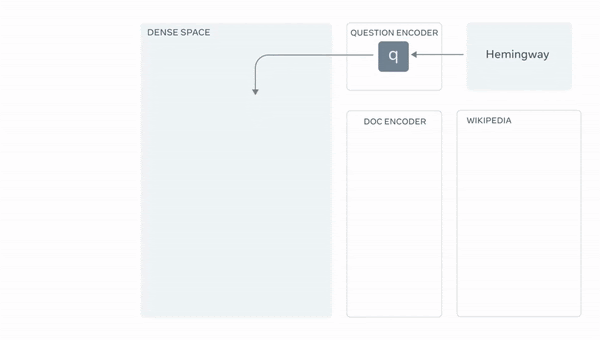

# Conversational-AI-System-using-Phi-2-PGVector-and-Llama-Index

In this tutorial, we will build a Conversational AI System that can answer questions by retrieving the answers from a document.

This whole tutorial is divided into 2 parts:
- Part 1: Indexing and Storing the Data (Notebook Name: `1. Indexing and Storing the Embeddings in PGVector.ipynb`)
    - Step 1: Install all the dependencies (Python and Database)
        - Python Dependencies
        - Database Dependencies
        - PGVector Extension
    - Step 2: Load the LLMs and Embeddings Model
        - LLMs
        - Embeddings Model
    - Step 3: Setup the database
    - Step 4: Index the documents
        - Download the data
        - Load the data
        - Index and store the embeddings
- Part 2: Querying the indexed data using LLMs (Notebook Name: `2. Querying the indexed data using LLMs.ipynb`)
    - Step 1: Load the LLMs and Embeddings Model
        - LLMs
        - Embeddings Model
    - Step 2: Load the index from the database
    - Step 3: Setup the query engine
    - Step 4: RAG pipeline in action
    - Step 5: Using gradio to build a UI

## Introduction to the RAG Pipeline

The Retrieval-Augmented Generation (RAG) pipeline is a powerful tool in the field of Natural Language Processing (NLP). It combines the strengths of two major NLP approaches: pre-trained language models and efficient information retrieval systems.

RAG operates by first retrieving relevant documents from a large corpus and then feeding the documents into a sequence-to-sequence model to generate responses. This allows the model to pull in information from external sources, making it more knowledgeable and versatile.

The pipeline is particularly useful in question-answering tasks, where it can leverage the retrieved documents to provide detailed and accurate answers.

  
   
  <em>The RAG Pipeline (source: <a href="https://huggingface.co/blog/ray-rag">Hugging Face</a>)</em>

## Part 1: Indexing and Storing Embeddings in PGVector

This Jupyter Notebook provides a comprehensive guide on how to index and store embeddings in a PostgreSQL database using the `PGVectorStore` from the `llama_index` library.

### Overview

The notebook begins by establishing a connection to a PostgreSQL database. This is a crucial step as it allows for the subsequent interaction with the database where the embeddings will be stored.

Once the connection is established, the notebook proceeds to create a `PGVectorStore` object. This object is a specialized data structure provided by the `llama_index` library, designed specifically for handling high-dimensional vectors, also known as embeddings.

Embeddings are a form of data representation where objects are transformed into high-dimensional vectors. The key characteristic of embeddings is that they preserve the relative similarity of the original objects. In other words, similar objects are close to each other in the embedding space, while dissimilar ones are far apart. This property makes embeddings extremely useful in a variety of machine learning and data analysis tasks.

The `PGVectorStore` object is created with a set of parameters that define the specifics of the database connection and the structure of the table where the embeddings will be stored. These parameters include the database name, host, password, port, username, table name, and the dimensionality of the embeddings.

This notebook serves as a practical guide for data scientists, machine learning engineers, and anyone interested in managing embeddings in a PostgreSQL database using Python. It provides a step-by-step approach, making it easy to follow and implement in your own projects.

## Part 2: Querying Indexed Data using Language Models

This Jupyter Notebook demonstrates how to query indexed data using large language models (LLMs). It uses the `microsoft/phi-2` model as the primary model for the demonstration. It also uses the `mistralai/Mistral-7B-Instruct-v0.2` model as a secondary model for comparison.

### Overview

The notebook guides you through the process of setting up a large language model and using it to query data that has been previously indexed and stored in a database. 

The language models used in this notebook are state-of-the-art models that have been trained on a diverse range of text. However, they can be fine-tuned on a specific task to improve their performance. In this case, the model is used to query indexed data, providing a powerful tool for extracting insights from large datasets.

The notebook proceeds to load the large language model. In this case, the `microsoft/phi-2` model is used. The model is loaded using the transformers library, which provides a simple and efficient way to handle pre-trained models.

The environment setup also involves preparing the database connection. This includes specifying the database details and establishing a connection. Once the connection is established, the indexed data stored in the database is ready to be queried using the language model.

Next comes the querying part, where the process begins by formulating a query. The query is a string of text that describes the information you're looking for. The language model takes this query and transforms it into a form that can be used to search the indexed data.

The transformed query is then passed to the database, which returns a set of results that match the query. These results are then post-processed and presented in a human-readable format.

This section provides several examples of queries and explains how to interpret the results. It also discusses the strengths and limitations of using language models for querying indexed data, providing valuable insights for anyone looking to use this approach in their own projects.

This notebook serves as a comprehensive guide for anyone interested in leveraging the power of large language models for querying indexed data. It provides a detailed, step-by-step approach, making it easy to follow and implement in your own projects. Whether you're a data scientist, machine learning engineer, or a curious enthusiast, this notebook will help you understand how to use large language models effectively.

# Conclusion

This project provides a comprehensive guide on how to index and store embeddings in a PostgreSQL database and then query the indexed data using large language models.

The first part of the project focuses on the process of indexing and storing embeddings. It demonstrates how to establish a connection to a PostgreSQL database and create a `PGVectorStore` object for handling high-dimensional vectors, also known as embeddings. This part of the project is crucial for anyone interested in managing embeddings in a PostgreSQL database using Python.

The second part of the project demonstrates how to query the indexed data using large language models. It uses the `microsoft/phi-2` model as the primary model for the demonstration and the `mistralai/Mistral-7B-Instruct-v0.2` model as a secondary model for comparison. This part of the project provides valuable insights into the power of large language models in extracting insights from large datasets.

Together, these notebooks serve as a practical guide for data scientists, machine learning engineers, and anyone interested in leveraging the power of large language models and embeddings in their data analysis tasks. They provide a step-by-step approach, making it easy to follow and implement in your own projects.